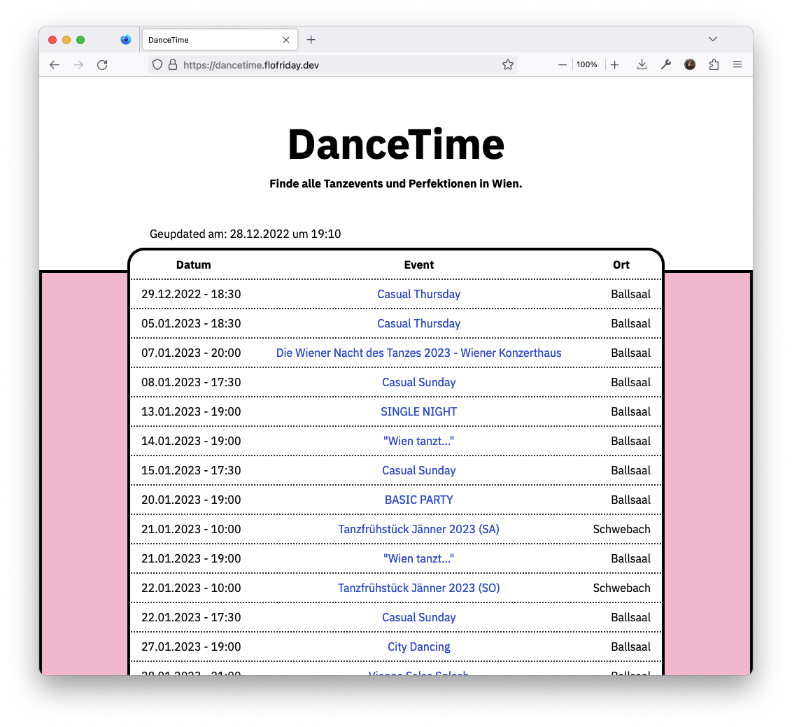

# dancetime 



A website to find dance events in Vienna.

[Live Website](https://dancetime.flofriday.dev/)

## Features 

A couple of my friends and I love to go (ballroom) dancing in Vienna. However, 
looking up a couple websites every week can be quite tedious. So this tool
crawls all of them normalizes them into a uniform format and outputs them as 
html, csv, json and as iCalendar to embed in your calendar.

At the moment it downloads from:
- [Ballsaal](https://www.ballsaal.at/termine_tickets/?no_cache=1)
- [Chris](https://www.tanzschulechris.at/perfektionen/tanzcafe_wien_1)
- [Schwebach](https://schwebach.at/events/)
- [Rueff](https://tanzschulerueff.at/)
- [Stanek](https://tanzschulestanek.at/)
- [Svabek](https://tanzschulewien.at/)

## Build it yourself

You need python3 with pip and venv, and node with npm.

```bash
npm install
npx tailwindcss -i template.css -o index.css
python3 -m venv venv
source venv/bin/activate
python -m pip install -r requirements.txt
python main.py
```

**Note:** While working on the frontend it might be quite handy to add the
`--watch` flag to the tailwind command so that it will automatically rebuild the 
css.

## How we deploy

I have a systemd timer setup that runs the script daily and the generated files 
are statically hosted with nginx.

You can see the systemd configuration in `dancetime.service` and 
`dancetime.timer`.

## Contributing

Contributions are very welcome. At the moment I only ask you to use black to 
format your code. You are awesome 😊🎉