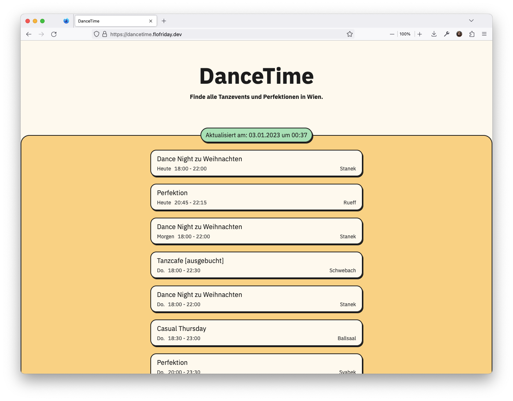

# dancetime 



A website to find dance events in Vienna.

[Live Website](https://dancetime.flofriday.dev/)

## Features 

A couple of my friends and I love to go (ballroom) dancing in Vienna. However, 
looking up a couple websites every week can be quite tedious. So this tool
crawls all of them normalizes them into a uniform format and outputs them as 
html, csv, json and as iCalendar to embed in your calendar.

At the moment it downloads from:
- [Ballsaal](https://www.ballsaal.at/termine_tickets/?no_cache=1)
- [Chris](https://www.tanzschulechris.at/perfektionen/tanzcafe_wien_1)
- [Immervoll](https://www.tanzschule-immervoll.at/events/)
- [Kopetzky](https://kopetzky.at/Perfektion)
- [Rueff](https://tanzschulerueff.at/)
- [Schwebach](https://schwebach.at/events/)
- [Stanek](https://tanzschulestanek.at/)
- [Svabek](https://tanzschulewien.at/)

## Build it yourself

You need [python3](https://www.python.org/downloads/) (only tested with python 3.11)
with [pip](https://pip.pypa.io/en/stable/) and [venv](https://docs.python.org/3/library/venv.html), and [node](https://nodejs.org/en/) with [npm](https://www.npmjs.com/package/npm).

```bash
npm install
npx tailwindcss -i template.css -o index.css
python3 -m venv venv
source venv/bin/activate
python -m pip install -r requirements.txt
python main.py
```

**Note:** While working on the frontend it might be quite handy to add the
`--watch` flag to the tailwind command so that it will automatically rebuild the 
css.

## Usage

```
usage: DanceTime [-h] [--output OUTPUT]

Aggregate dance envents and compile them into multiple formats.

options:
  -h, --help       show this help message and exit
  --output OUTPUT  folder into which the outputs should be written.
```

## How we deploy

We directly deploy the main branch to [dancetime.flofriday.dev](https://dancetime.flofriday.dev)
with our CI/CD [GitHub Action](https://docs.github.com/en/actions).

On the linux server we have a [systemd](https://systemd.io/) timer setup that 
runs the script hourly and the generated files are statically hosted with 
[nginx](https://nginx.org/en/).

You can see the systemd configuration in `dancetime.service` and 
`dancetime.timer`.

## Contributing

Contributions are very welcome. At the moment I only ask you to use black to 
format your code. You are awesome 😊🎉